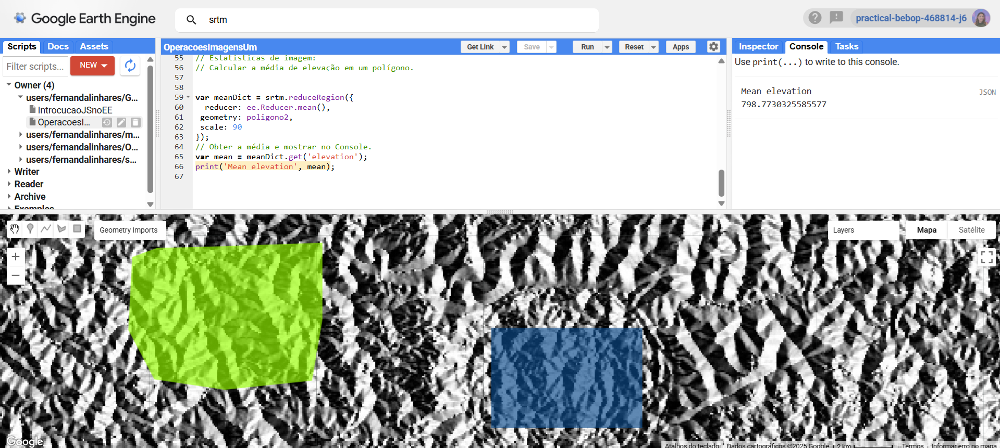

# 📌 OPERAÇÕES COM IMAGENS NO GOOGLE EARTH ENGINE – PARTE 1

### Estatística de Imagem • Álgebra de Imagens • Visualizações • Declividade • Aspecto

Este repositório contém um exercício desenvolvido durante a **Pós-Graduação em Ciência de Dados Geoespaciais**, utilizando a plataforma **Google Earth Engine (GEE)**.
Aqui são explorados conceitos fundamentais de manipulação de imagens raster, álgebra de bandas e estatísticas espaciais usando JavaScript dentro do Code Editor.

---

## 🚀 Executar este projeto no Google Earth Engine

👉 **Clique para abrir o script no GEE Code Editor:**
🔗 **[https://code.earthengine.google.com/7e35ad6f3297ea08f87521ee6982868f]**

---

# 📦 Imports / Assets utilizados

| Tipo                       | Nome / Caminho                       | Descrição                          |
| -------------------------- | ------------------------------------ | ---------------------------------- |
| 📄 **Dataset**             | `CGIAR/SRTM90_V4`                    | Modelo digital de elevação (90m)   |
| 📐 **Funções nativas**     | `ee.Terrain.slope()`                 | Calcula declividade                |
| 📐 **Funções nativas**     | `ee.Terrain.aspect()`                | Calcula aspecto                    |
| 🔣 **Funções matemáticas** | `.divide()`, `.multiply()`, `.sin()` | Usadas na álgebra de imagens       |
| 🔷 **Geometria**           | `poligono2` *(asset pessoal)*        | Polígono usado no cálculo da média |

Se quiser, posso adicionar o link ou ID do seu **asset `poligono2`**.

---

# 🗺️ Área de estudo: Domo de Vargeão – SC

A área corresponde ao famoso *astroblema* de Vargeão, estrutura circular com cerca de **10 km de diâmetro**, originada pela queda de um meteorito.
A cidade cresceu sobre a borda dessa cratera e hoje possui mirantes e trilhas.

📌 **Coordenadas do centro usado no exercício:**
`(-52.16111746507226, -26.82068809664134)`

---

# 📝 Código completo do exercício

```javascript
// ---- CONCEITOS BÁSICOS DE JAVASCRIPT PARA O GEE ----

// Criação de uma imagem simples
var image = ee.Image('CGIAR/SRTM90_V4');

// Centraliza o mapa no Domo de Vargeão (SC)
Map.setCenter(-52.16111746507226,-26.82068809664134, 11);

// Exemplos de visualização (comentados)
// Map.addLayer(image);
// Map.addLayer(image, {min: 0, max: 3000}, 'visualização customizada');
// Map.addLayer(image, {min: 500, max: 1300, palette: ['blue', 'green', 'red', 'yellow']}, 'paleta customizada');

// Aplicação de algoritmo: declividade
var srtm = ee.Image('CGIAR/SRTM90_V4');
var slope = ee.Terrain.slope(srtm);
Map.addLayer(slope, {min: 0, max :60}, 'declividade');

// Álgebra de Imagens: seno do aspecto
var aspecto = ee.Terrain.aspect(srtm);
var senoImagem = aspecto.divide(180).multiply(Math.PI).sin();
Map.addLayer(senoImagem, {min: -1, max: 1}, 'sen');

// Estatísticas: média da elevação dentro de um polígono
var meanDict = srtm.reduceRegion({
  reducer: ee.Reducer.mean(),
  geometry: poligono2,
  scale: 90
});

var mean = meanDict.get('elevation');
print('Mean elevation', mean);
```

---

# 🖼️ Prints de tela do exercício

Aqui você pode colocar as imagens do seu processo.
Basta colocar os arquivos em uma pasta `/imagens` no repositório e substituir os nomes a seguir 👇

### **Visualização do SRTM**


### **Declividade (Slope)**


### **Seno do Aspecto**


### **Polígono usado para estatística**



---

# 🧭 Interpretação da área

* A imagem SRTM mostra um **formato circular característico** de estruturas de impacto.
* A escala e o zoom utilizados permitem perceber claramente a borda elevada da cratera.
* Medições indicam um **diâmetro aproximado de 10 km**.
* A cidade de **Vargeão** se desenvolveu sobre essa estrutura, ocupando parte de sua borda.
* O exercício demonstra como dados altimétricos ajudam a identificar padrões morfológicos.

---

# ✔️ Conclusões

Este exercício permitiu praticar:

* manipulação de imagens no GEE
* uso de funções de terreno (slope, aspect)
* aplicação de álgebra de bandas
* cálculo de estatísticas com `reduceRegion()`
* interpretação geomorfológica baseada em dados altimétricos

Uma base essencial para análises avançadas em geoprocessamento e ciência de dados geoespaciais.


